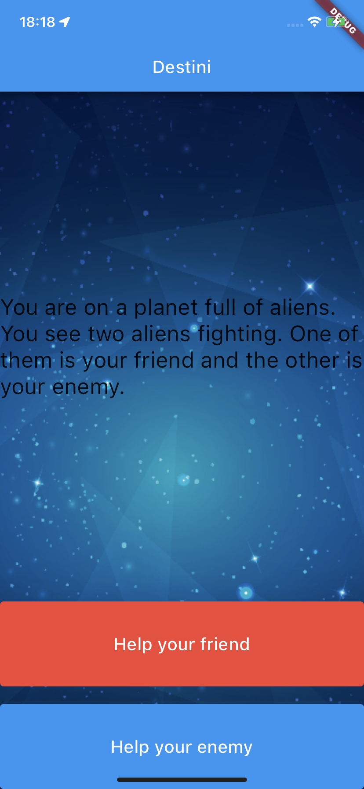
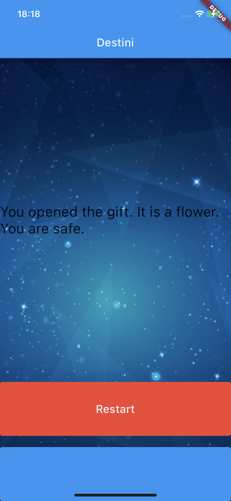

<h1>Destini App</h1>

<p>
  
  
</p>

## About the Project

Destini App is a Flutter application that lets users experience an interactive choose-your-own-adventure story. Users can make choices at each stage of the story, leading to different outcomes based on their decisions.

## Features

- Interactive Storytelling: Users can make choices that affect the direction of the story.
- Multiple Endings: The app offers multiple story endings based on user decisions.
- Engaging Experience: Enjoy an immersive and captivating storytelling experience.

## Installation

1. Clone this repository or download it as a zip file:

```
git clone https://github.com/denaktepe/destini-app.git
```


2. Navigate to the project directory:

```
cd Destini_App
```

3. Install the required packages:

```
flutter pub get
```


4. Run the app:

```
flutter run
```


## How to Play

1. Open the app and start the adventure by reading the beginning of the story.
2. At each stage, you will be presented with multiple choices.
3. Tap on the option you want to choose to proceed with the story.
4. Continue making choices until you reach one of the story's multiple endings.

## Contributing

If you'd like to contribute to this project, please follow these steps:

1. Fork this repository to your GitHub account.
2. Create a new branch: `git checkout -b my-feature`
3. Make your changes and commit them: `git commit -m "Add a new feature"`
4. Push your changes: `git push origin my-feature`
5. Open a pull request and share your changes.

## Contact

For any questions, suggestions, or feedback, please email me at sametcagriaktepe@gmail.com

